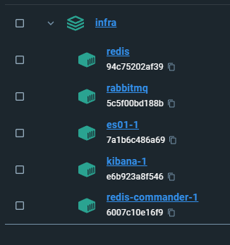

Run elasticsearch setup, required once

```bash
docker compose up -d
```

Once the setup is completed you can remove the stopped setup service container, this is required to prevent the
application stack being marked as unhealthy

```bash
docker compose rm setup -vf
```

Now you can start the management tools, kibana and redis commander

```bash
docker compose --profile tools up -d
```

Stopping the stack

```bash
docker compose --profile tools stop
```

Generating new encryption keys for Kibana
```bash
docker exec -it infra-kibana-1 /usr/share/kibana/bin/kibana-encryption-keys generate -q
```




